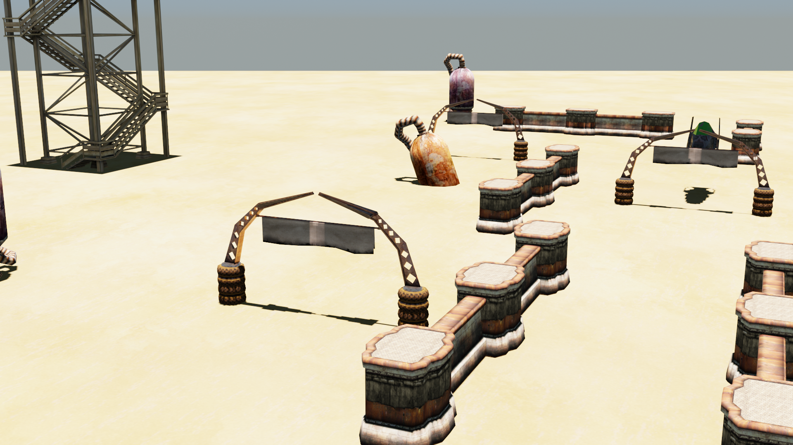

# Desert Racer

Third Game for the *Games Concepts* module of first year of BSc Software Engineering at [UCLan][uclan].

*image not representative of actual gameplay*

## About

Made with the "help" of [TL-Engine][tlengine].

TL-Engine's license is unknown.

## Authorship

Jacob Sanchez Perez \<jsanchez-perez@uclan.ac.uk>

Not particularly proud of this one.

## License

[![MIT License][license-badge]][license]

This software is distributed under the [MIT License][license].

[uclan]: https://uclan.ac.uk

[license]: LICENSE "MIT License"

[license-badge]: https://img.shields.io/github/license/jacobszpz/DesertRacer
[tlengine]: https://www.mantasbuzelis.dev/resources/tl_engine/downloads.html

 

