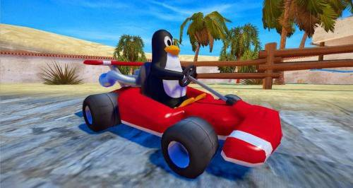

# Desert Racer

### \#NotAnotherMarioKartClone

Third Game for the *Games Concepts* module of first year of BSc Software Engineering at UCLan.

*image not representative of actual gameplay*

## About

Made with the help of [TL-Engine](http://www.gamesnorthwest.net/resources/tl_engine/index.html).

## Authorship

Jacob Sanchez Perez (G20812080) \<jsanchez-perez@uclan.ac.uk>

## License

[![License: GPL  v2][license-badge]][gnu]

This software is distributed under the [General Public License v2.0][license], more information available at the [Free Software Foundation][gnu].

[license]: LICENSE "General Public License"
[gnu]: https://www.gnu.org/licenses/old-licenses/gpl-2.0.html "Free Software Foundation"
[license-badge]: https://img.shields.io/badge/License-GPL%20v2-blue.svg

 

